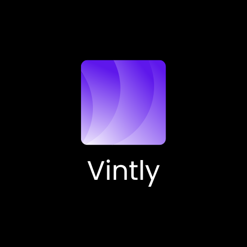
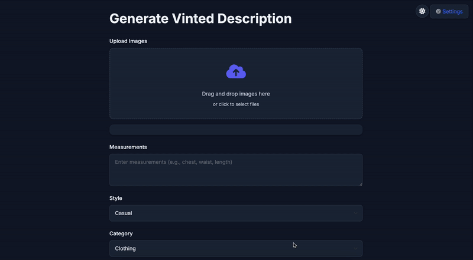

<div align="center">

# Vintly

A powerful tool that generates professional, multilingual descriptions for Vinted listings using AI. Upload your product images and get detailed, SEO-optimized descriptions in multiple languages.



<div align="center">
  
[](https://www.python.org/)
[](https://flask.palletsprojects.com/)
[](https://www.sqlalchemy.org/)
[](https://ai.google.dev/)
[](https://getbootstrap.com/)
[](https://developer.mozilla.org/en-US/docs/Web/JavaScript)

</div>
</div>

## Features

- 🤖 AI-powered description generation
- 🌍 Multilingual support (English, Polish, Danish)
- 🖼️ Drag-and-drop image upload
- 🎨 Multiple description styles (Professional, Casual, Detailed)
- 📏 Custom measurements support
- 🏷️ Category-specific descriptions
- 🌓 Dark/Light mode
- 💾 Save your preferences
- 📋 Copy to clipboard functionality

## Video Demo

<div align="center">
  
</div>

## Installation

### Prerequisites

- Python 3.8 or higher
- pip (Python package installer)
- Google API key for Gemini AI

### Steps

1. Clone the repository:

```bash
git clone https://github.com/yourusername/vinDesc.git
cd vinDesc
```

2. Create and activate a virtual environment (recommended):

```bash
python -m venv .venv
source .venv/bin/activate  # On Windows, use: .venv\Scripts\activate
```

3. Install required packages:

```bash
pip install -r requirements.txt
```

4. Create a `.env` file in the project root and add your Google API key:

```
GOOGLE_API_KEY=your_api_key_here
```

5. Run the application:

```bash
python app.py
```

The application will be available at `http://localhost:5000`

## Usage

1. **Upload Images**

   - Drag and drop images or click to select files
   - Supported formats: PNG, JPG, JPEG
   - Maximum file size: 16MB
   - Preview and remove images before generating description

2. **Configure Settings**

   - Click the settings icon (⚙️) to open settings panel
   - Set your preferred languages and description style
   - Save your preferences for future use

3. **Add Details**

   - Enter product measurements
   - Select category (Clothing, Shoes, Accessories)
   - Choose description style if different from preferred

4. **Generate Description**

   - Click "Generate Description"
   - Wait for AI to process your images
   - Copy the generated description to clipboard

5. **Manage Templates**

   - Access the templates page to manage your description templates
   - Add, edit, or delete custom templates
   - Templates are saved automatically

6. **Theme Toggle**
   - Use the moon/sun icon to switch between light and dark modes

## Contributing

Contributions are welcome! Please feel free to submit a Pull Request.

## License

This project is licensed under the MIT License - see the LICENSE file for details.

## Acknowledgments

- Google Gemini AI for providing the AI capabilities
- Flask for the web framework
- Bootstrap for the UI components
- Font Awesome for icons
